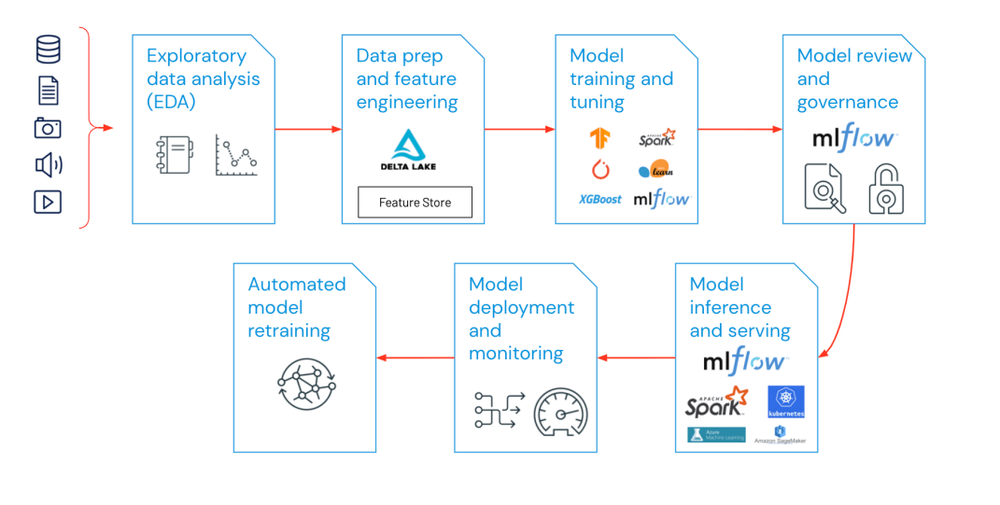
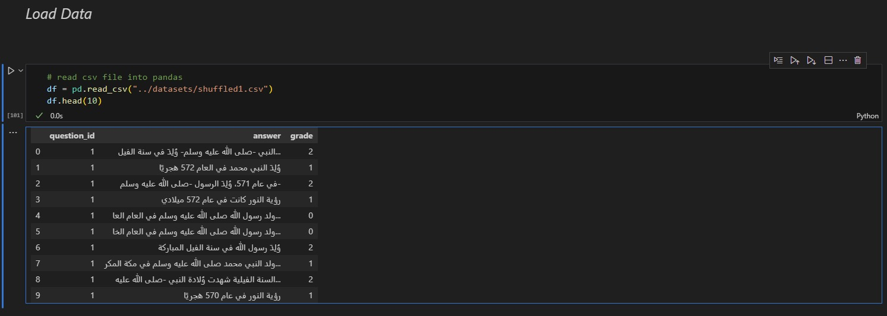
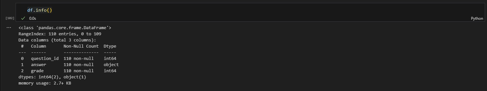
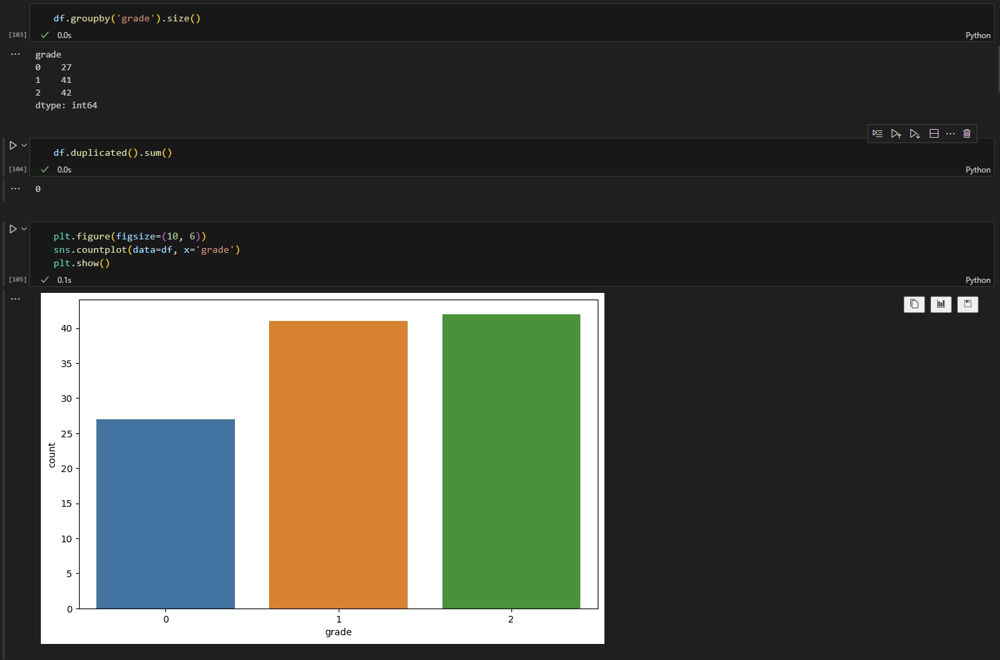
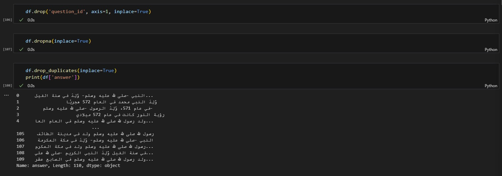
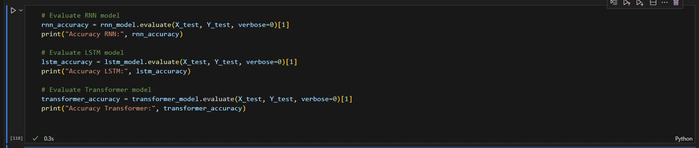
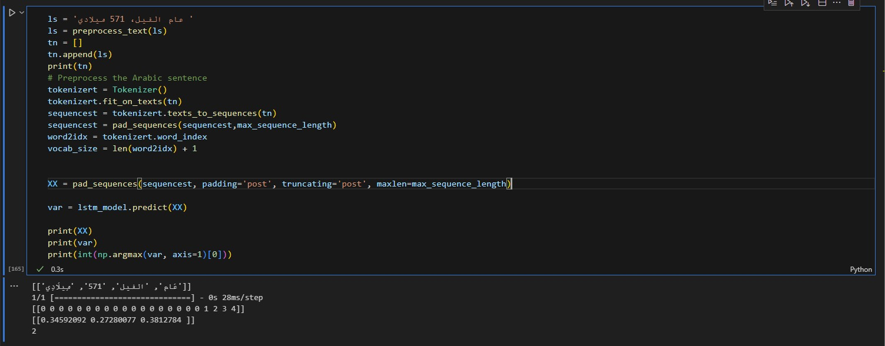
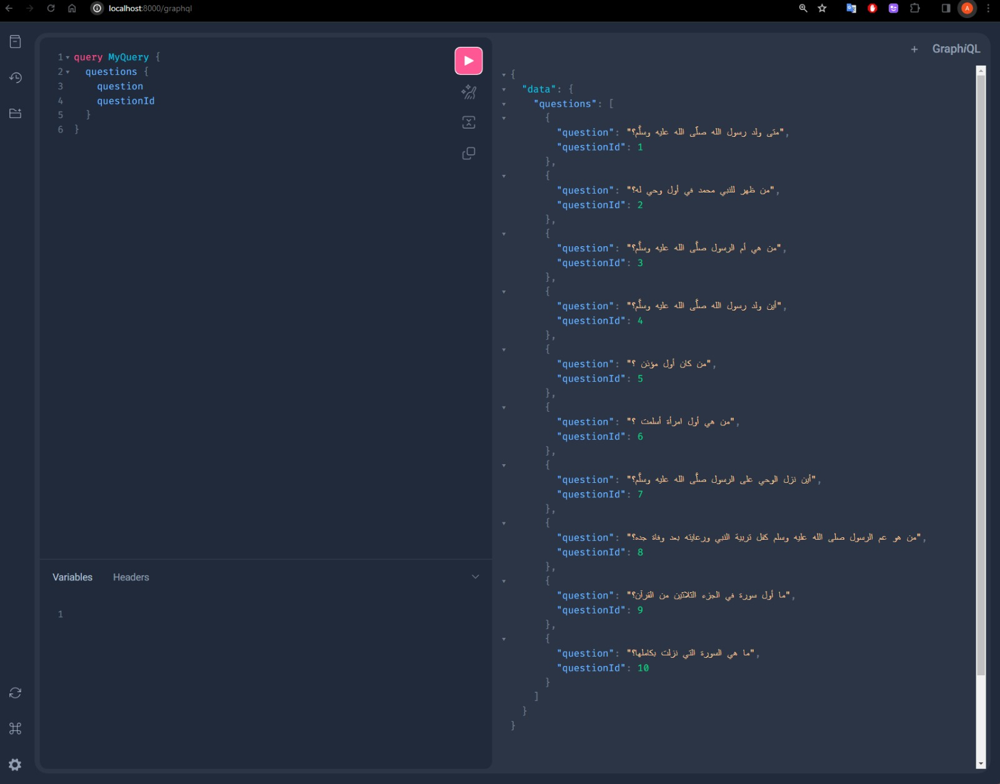

# Arabic Automated Short Answers Grading System

The project aims to develop an Arabic Automated Short Answers Grading System and Smart Assistance for Islamic education for schoolers. The system's primary goal is to assign grades (ranging from 0 to 20) to students based on the accuracy of their answers. It will be entirely in Arabic, and the dataset will be prepared by collecting raw data from various resources using scraping techniques.

- Scraping data from several sources: Arabic websites, Datasets, books, etc.
- Establishment of Arabic Natural language processing pipeline.
- Word embedding and encoding.
- Model Training based on classical machine learning algorithms.
- Evaluation of the models then the choice of the best one
- Model deployment and consumption via spa web application.

**Tools :** FastAPI, GraphQL, Angular, Tailwindcss, Docker, Github, Scrapy, NLTK, Word2Vec.

## Table of contents

[Scraping Data](#scraping-data)

[Establishment of Arabic Natural language processing pipeline](#establishment-of-arabic-natural-language-processing-pipeline)

[Exploratory data analysis (EDA)](#exploratory-data-analysis)
* [Loading Data](#loading-data)
* [Characteristics Of Dataset](#characteristics-of-dataset)
* [Data Cleaning](#data-cleaning)

[Data Pre-Preprocessing](#data-pre-preprocessing)
* [Split Data](#split-data)

[build Models](#build-models)
* [Testing  Models](#testing-models)
* [Saving The Best Model](#saving-the-best-model)

[Backend of our Application](#backend-of-our-application)
* [FastAPI](#fastapi)
* [GraphQL Server Side](#graphql-server-side)
* [Docker Server Side](#docker-server-side)

[Frontend of our Application](#frontend-of-our-application)
* [Angular](#angular)
* [GraphQL Client Side](#graphql-client-side)
* [Docker Client Side](#docker-client-side)

[Testing the Application](#testing-the-application)
* [Home Page](#home-page)
* [Question Page](#question-page)
* [Result Page](#result-page)
[Contributors](#contributors)


## Scraping data

The initial step in our project involves collecting raw data from diverse sources, including Arabic websites, datasets, and educational books. This varied dataset is essential for training and evaluating our Arabic Automated Short Answers Grading System and Smart Assistance for Islamic education.

### Procedure

To gather relevant and comprehensive data, we employ scraping techniques, accessing Arabic websites, exploring existing datasets, and referencing educational books. This process ensures the creation of a dataset that captures the linguistic and educational nuances of the Arabic language.


# Establishment of Arabic Natural Language Processing Pipeline

In our project, the establishment of an Arabic Natural Language Processing (NLP) pipeline is a critical component. A pipeline, in the realm of machine learning, comprises a series of interconnected steps designed to address specific challenges in the Arabic language domain. This structured sequence of operations facilitates data processing, model training, and predictions on new data.




## Project Overview

Our approach involves treating each question as an individual model, considering them as distinct entities within the broader framework. This strategy enables us to focus on the unique requirements and characteristics of each question, leading to the development of tailored solutions for optimal results.

I will now outline the process we followed for Question 1, which was repeated for the other questions as well.

### Exploratory Data Analysis

### Loading Data



### Characteristics Of Dataset





The dataset has an even balance.

### Data Cleaning

For data cleaning, we performed two essential tasks to ensure better performance for our model: removing duplicate values and handling null values.



### Data Pre-Preprocessing


Data preprocessing stands as a pivotal phase in machine learning, encompassing the transformation of raw data into a format suitable for model training. The objective is to enhance data quality and usability by addressing issues like missing values, outliers, inconsistencies, and irrelevant features. This process significantly contributes to improving the performance and accuracy of machine learning models.

Within our data processing pipeline, we leveraged the **`nltk.tokenize`** module's **`word_tokenize`** function for tokenization. This function efficiently breaks down sentences or paragraphs into individual words or tokens. Utilizing **`word_tokenize`** provided us with a comprehensive list of tokens, where each token represented a unique word in the text.

Additionally, we incorporated the **`gensim.models`** module's **`Word2Vec`** class for generating word embeddings.


```python
tokenizer = Tokenizer()
tokenizer.fit_on_texts(df['answer'])
sequences = tokenizer.texts_to_sequences(df['answer'])
max_sequence_length = max(len(s) for s in sequences)
sequences = pad_sequences(sequences,max_sequence_length)
word2idx = tokenizer.word_index
vocab_size = len(word2idx) + 1
```

```python
X = pad_sequences(sequences, padding='post', truncating='post', maxlen=max_sequence_length)
Y = to_categorical(df['grade'], num_classes=3)
```

### Split Data

To split the data for training and testing purposes, considering our relatively small dataset, we allocated 15% of the data for testing and the remaining portion for training the model.

```python
X_train, X_test, Y_train, Y_test = train_test_split(X, Y, test_size=0.15, random_state=42)
```
### build Models

In the model-building phase, I employed a diverse set of machine learning models, specifically focusing on LSTM (Long Short-Term Memory), RNN (Recurrent Neural Network), and Transformers. This approach aimed to identify the most effective model for the given task of short answers grading.

The models utilized for classification encompassed LSTM, RNN, and Transformers, each offering distinctive learning algorithms and capabilities. This diverse set allowed for a comprehensive exploration of different approaches to sequence modeling and classification. The goal was to pinpoint the model that demonstrated superior performance in handling the intricacies of evaluating short answers in an automated grading system.

#### RNN Model

```python
def RNN_model(vocab_size, sequence_length):
    model = Sequential()
    model.add(Embedding(input_dim=vocab_size, output_dim=128, input_length=sequence_length))
    model.add(SimpleRNN(units=128, activation='relu', return_sequences=True))
    model.add(BatchNormalization())
    model.add(SimpleRNN(units=64, activation='sigmoid'))
    model.add(Dense(256, activation='sigmoid', kernel_regularizer=l2(0.001)))
    model.add(Dropout(0.2))
    model.add(Dense(3, activation='softmax'))
    optimizer = Adam(learning_rate=0.001)
    model.compile(optimizer=optimizer, loss='categorical_crossentropy', metrics=['accuracy'])
    return model
```

#### LSTM Model

```python
def LSTM_model(vocab_size, sequence_length):
    model = Sequential()
    model.add(Embedding(input_dim=vocab_size, output_dim=128, input_length=sequence_length))
    model.add(LSTM(units=128, activation='relu', return_sequences=True))
    model.add(BatchNormalization())
    model.add(LSTM(units=64, activation='relu'))
    model.add(Dense(256, activation='relu', kernel_regularizer=l2(0.001)))
    model.add(Dropout(0.2))
    model.add(Dense(3, activation='softmax'))
    optimizer = Adam(learning_rate=0.001)
    model.compile(optimizer=optimizer, loss='categorical_crossentropy', metrics=['accuracy'])
    return model
```

#### TRANSFORMER Model

```python
class TransformerBlock(layers.Layer):
    def _init_(self, embed_dim, num_heads, density, rate=0.1, l2_reg=0.01):
        super(TransformerBlock, self)._init_()
        self.att = layers.MultiHeadAttention(num_heads=num_heads, key_dim=embed_dim)
        self.ffn = tf.keras.Sequential([
            layers.Dense(density, activation="relu", kernel_regularizer=tf.keras.regularizers.l2(l2_reg)),
            layers.Dense(embed_dim, kernel_regularizer=tf.keras.regularizers.l2(l2_reg)),
        ])
        self.layernorm1 = layers.LayerNormalization(epsilon=1e-6)
        self.layernorm2 = layers.LayerNormalization(epsilon=1e-6)
        self.dropout1 = layers.Dropout(rate)
        self.dropout2 = layers.Dropout(rate)

    def call(self, inputs, training):
        attn_output = self.att(inputs, inputs)
        attn_output = self.dropout1(attn_output, training=training)
        out1 = self.layernorm1(inputs + attn_output)
        ffn_output = self.ffn(out1)
        ffn_output = self.dropout2(ffn_output, training=training)
        return self.layernorm2(out1 + ffn_output)


class TokenAndPositionEmbedding(layers.Layer):
    def _init_(self, maxlen, vocab_size, embed_dim):
        super(TokenAndPositionEmbedding, self)._init_()
        self.token_emb = layers.Embedding(input_dim=vocab_size, output_dim=embed_dim)
        self.pos_emb = layers.Embedding(input_dim=maxlen, output_dim=embed_dim)

    def call(self, x):
        maxlen = tf.shape(x)[-1]
        positions = tf.range(start=0, limit=maxlen, delta=1)
        positions = self.pos_emb(positions)
        x = self.token_emb(x)
        return x + positions

def build_transformer_model(maxlen, vocab_size, embed_dim, num_heads, density, transformer_units, mlp_units, dropout_rate, num_classes):
    inputs = layers.Input(shape=(maxlen,))
    embedding_layer = TokenAndPositionEmbedding(maxlen, vocab_size, embed_dim)
    x = embedding_layer(inputs)
    for _ in range(transformer_units):
        x = TransformerBlock(embed_dim, num_heads, density, rate=dropout_rate)(x)
    x = layers.GlobalAveragePooling1D()(x)
    for dim in mlp_units:
        x = layers.Dense(dim, activation="relu")(x)
        x = layers.Dropout(dropout_rate)(x)
    outputs = layers.Dense(num_classes, activation="softmax")(x)
    model = tf.keras.Model(inputs=inputs, outputs=outputs)
    return model
```

Assessing the performance of these models is essential to gauge their effectiveness and suitability for the given problem. One commonly used metric for measuring model performance is accuracy. Accuracy provides an indication of how well the model predicts the correct outcomes compared to the total number of predictions made.

In the following sections, we will analyze and compare the accuracy of the different models we employed, shedding light on their strengths and weaknesses in handling the task at hand.



```
Accuracy RNN: 0.8823529481887817
Accuracy LSTM: 0.7411764740943909
Accuracy Transformer: 0.8647058963775635
```

To determine the best model, I relied on accuracy as the primary performance metric , I also factored in the risk of overfitting by avoiding models with accuracy close to 100%. To conduct a comprehensive evaluation, I generated a diverse test dataset and applied it to all the models, scrutinizing their performance. The model selection was based on achieving the highest accuracy without nearing the 100% mark, a potential indicator of overfitting. This approach aimed to strike a balance between accuracy and generalization, ultimately pinpointing the model with optimal performance for the given task.


```python
best_model_name, best_model_accuracy = max([('RNN', rnn_accuracy), ('LSTM', lstm_accuracy), ('Transformer', transformer_accuracy)], key=lambda x: x[1])
save_path = './savedModels/q1_model.h5'

print(f"The best model ({best_model_name}) with accuracy {best_model_accuracy} has been saved to '{save_path}'")
```

```
The best model (RNN) with accuracy 0.8823529481887817 has been saved to './savedModels/q1_model.h5'
```

### Testing Models



### Saving The Best Model

After evaluating and selecting the model with optimal performance, it's crucial to preserve its state for future use. This involves saving the trained model's parameters, architecture, and weights. By doing so, we ensure the ability to seamlessly deploy and utilize the best-performing model without the need for retraining. The process of saving the model allows for efficient retrieval and integration into the overall system, contributing to the system's robustness and sustainability.


```python
save_path = './savedModels/q1_model.h5'
# Save the best model
if best_model_name == 'RNN':
    rnn_model.save(save_path)
elif best_model_name == 'LSTM':
    lstm_model.save(save_path)
elif best_model_name == 'Transformer':
    transformer_model.save(save_path)
```

## Backend of our application

### FastAPI

For the backend we choose **FastAPI** framework ****because it’s fast to learn and to use.

First we create a virtual environment :

```
python -m venv venv
```

We have to activate the new virtual environment by executing the command :

```
venv/Scripts/Activate.ps1
```

Concerning the python libraries we used, this is the `requirements.txt` file of our backend application :

```
anyio==3.6.2
click==8.1.3
colorama==0.4.6
fastapi==0.95.1
gensim==4.3.1
graphql-core==3.2.3
h11==0.14.0
httptools==0.5.0
idna==3.4
joblib==1.2.0
nltk==3.8.1
numpy==1.24.3
pandas==2.0.1
pydantic==1.10.7
python-dateutil==2.8.2
python-dotenv==1.0.0
pytz==2023.3
PyYAML==6.0
regex==2023.5.5
scikit-learn==1.2.2
scipy==1.10.1
six==1.16.0
smart-open==6.3.0
sniffio==1.3.0
starlette==0.26.1
strawberry-graphql==0.177.1
threadpoolctl==3.1.0
tqdm==4.65.0
typing_extensions==4.5.0
tzdata==2023.3
uvicorn==0.22.0
watchfiles==0.19.0
websockets==11.0.3
```

### GraphQL Server Side

For communication between the frontend and backend, we opted for **GraphQL**  a query language for APIs and a runtime for handling those queries with the available data.

Integration into our application was achieved through the utilization of the ************Strawberry.************ library. This library, designed for Python 3 and inspired by dataclasses, provided the necessary functionality for seamless **GraphQL**  implementation.



### Docker Server Side

To build and run our application we used **Docker.**

We create a `Dockerfile` and `docker-compose.yml` file.

The `Dockerfile` contains the following code :

```
FROM python

# Set the working directory in the container
WORKDIR /app

# Copy the requirements file to the container
COPY ./requirements.txt .

# Install dependencies
RUN pip install -r requirements.txt

# Copy the rest of the project files to the container
COPY . .

# Expose the port that the application will be running on
EXPOSE 8000
```

The `docker-compose.yml` contains the following code :

```
version: '3.10'
services:
  app:
    build: .
    command: uvicorn main:app --host 0.0.0.0
    ports:
      - "8000:8000"
```

To build and run the application in **************Docker************** we used the following command :

```
docker-compose up
```

 


## Frontend of our application

### Angular

For the frontend we choose **Angular** and ************************TailwindCSS************************ framework.


### GraphQL Client Side

To use **************GraphQL************** in the client side we needed also to download a library called `apollo-angular` so we did using this command :

```
ng add apollo-angular
```

 We needed to set the URL of our GraphQL Server in the `src/app/graphql.module.ts` file :

```
const uri = 'http://localhost:8000'; // <-- the URL of our GraphQL server
```

### Docker Client Side

To build and run our frontend application we created a `Dockerfile` containing the following code :

```
# Build stage
FROM node:18.13.0-alpine as build
RUN mkdir -p /app

WORKDIR /app

COPY package.json /app/
RUN npm install

COPY . /app/
RUN npm run build --prod

# Prod stage
FROM nginx:alpine
COPY --from=build /app/dist/answers-grading-system-frontend /usr/share/nginx/html
```

To build the application in **************Docker************** we use the following command :

```
docker build --tag answers-grading-system-frontend .
```


To run it we used :

```
docker run -d -p 4200:80 --name answers-grading-system-frontend answers-grading-system-frontend
```


## Testing the Application

### Home Page


### Question Page

By clicking on the button ****ابدأ الاختبار**** the test will begin :


### Result Page

By clicking on the button ****عرض النتيجة**** the grades given by the models we trained will showed with the correct answers :


## Contributors

<a href="https://github.com/ahmed-bentajhamyani/answers-grading-system-application/graphs/contributors">
  
</a>


